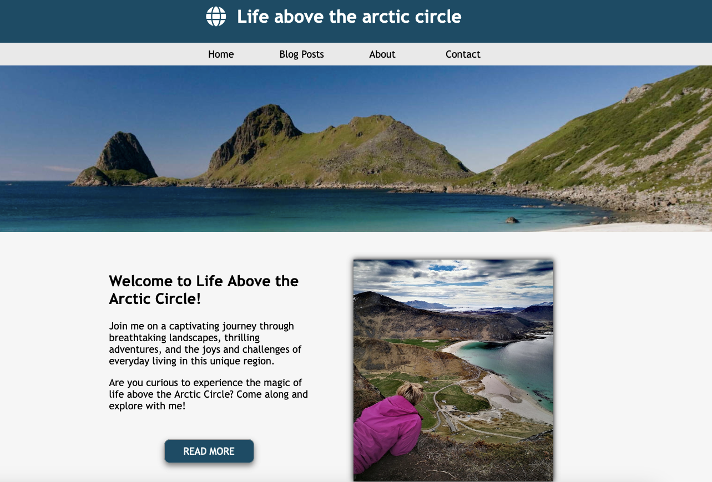

# Project Exam 1


## Table of Contents
* [Screenshot](#screenshot)
* [General info](#General-info)
* [Built with](#built-with)
* [Getting started](#getting-started)
* [Links](#Links) 
* [Contact](#contact)

## General info
Life above the arctic circle is a blog using WordPress as CMS and fetching the content from the WordPress API.

This exam project contains everything we have learned this school year. From planning a task, creating a prototype, writing code using html and css as well as creating functions with javascript and create API using Wordpress.

## Built with
This project is built using:
- HTML & CSS
- Javascript
- WordPress

## Getting started
### Installing
1. Clone the repo
```
git clone https://github.com/chalund/Exam-1
```
### Running
This project only contain static files, will run on all devices

## Links
[Link to site](https://lifeabove.netlify.app/)  

## Contact
[](https://pe.linkedin.com/in/charlotte-lund-48419b249/)
[](https://github.com/chalund)
